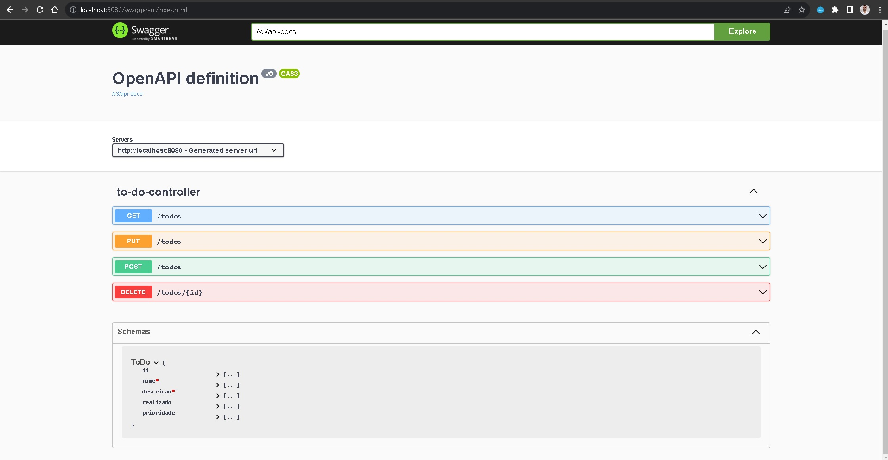

# ToDo List App


Este é um projeto de exemplo de uma aplicação de lista de tarefas usando Spring Boot.

## Conteúdo

1. [Visão Geral](#visão-geral)
2. [Requisitos](#requisitos)
3. [Configuração do Banco de Dados](#configuração-do-banco-de-dados)
4. [Executando o Projeto](#executando-o-projeto)
5. [Endpoints da API](#endpoints-da-api)
6. [Documentação da API](#documentação-da-api)
7. [Contribuição](#contribuição)

## Visão Geral

Este projeto é uma aplicação de lista de tarefas (ToDo List) construída com Spring Boot. Ele oferece endpoints para criar, listar, atualizar e excluir tarefas em uma lista de tarefas.

A controller principal do projeto é `ToDoController`, que define os endpoints da API.

```java
package com.marcioviana.todolist.controller;

import com.marcioviana.todolist.entity.ToDo;
import com.marcioviana.todolist.service.ToDoService;
import jakarta.validation.Valid;
import org.springframework.web.bind.annotation.*;

import java.util.List;

@RestController
@RequestMapping("/todos")
public class ToDoController {

    private final ToDoService toDoService;

    public ToDoController(ToDoService toDoService) {
        this.toDoService = toDoService;
    }

    @PostMapping
    List<ToDo> create(@RequestBody @Valid ToDo toDo){
        return toDoService.create(toDo);
    }

    @GetMapping
    List<ToDo> list(){
        return toDoService.list();
    }

    @PutMapping
    List<ToDo> update(@RequestBody ToDo toDo){
        return toDoService.update(toDo);
    }

    @DeleteMapping("/{id}")
    List<ToDo> delete(@PathVariable("id") Long id){
        return toDoService.delete(id);
    }
}
```

### Requisitos

- Certifique-se de ter as seguintes ferramentas e dependências instaladas em sua máquina antes de prosseguir:

- Java 17
- Maven
- MySQL
- H2 (utilizado para os testes da aplicação)
  
### Configuração do Banco de Dados

- Esta aplicação utiliza o banco de dados MySQL. Antes de executar o projeto, siga estas etapas:

1. Crie um banco de dados chamado `todolist` no MySQL.

2. Atualize as configurações de conexão no arquivo application.properties em src/main/resources com seu nome de usuário e senha do MySQL:
   
```
spring.datasource.url=jdbc:mysql://localhost:3306/todolist
spring.datasource.username=seu_usuario
spring.datasource.password=sua_senha
spring.jpa.hibernate.ddl-auto=update
```
### Executando o Projeto

Para executar o projeto, siga estas etapas:


1. Clone o repositório:
```
git clone https://github.com/VianaMarcioDev/ToDo-List.git
```

2. Navegue até o diretório do projeto:
```
cd toDo-List
```

3. Compile o projeto:
```
mvn clean install
```

4. Execute o aplicativo:
```
mvn spring-boot:run
```

O aplicativo estará disponível em `http://localhost:8080`.

### Endpoints da API

A API oferece os seguintes endpoints:

- POST /todos: Cria uma nova tarefa.
- GET /todos: Lista todas as tarefas.
- PUT /todos: Atualiza uma tarefa existente.
- DELETE /todos/{id}: Exclui uma tarefa por ID.
  
Certifique-se de usar um cliente REST como `Postman` ou `curl` para interagir com a API.

### Documentação da API

A documentação da API está disponível em `http://localhost:8080/swagger-ui/index.html` após a execução do aplicativo. Você pode usar essa interface interativa para explorar e testar os endpoints da API.




### Contribuição

Sinta-se à vontade para contribuir com melhorias para este projeto. Se você deseja relatar um problema ou sugerir uma melhoria, abra uma issue.

 

   
   


